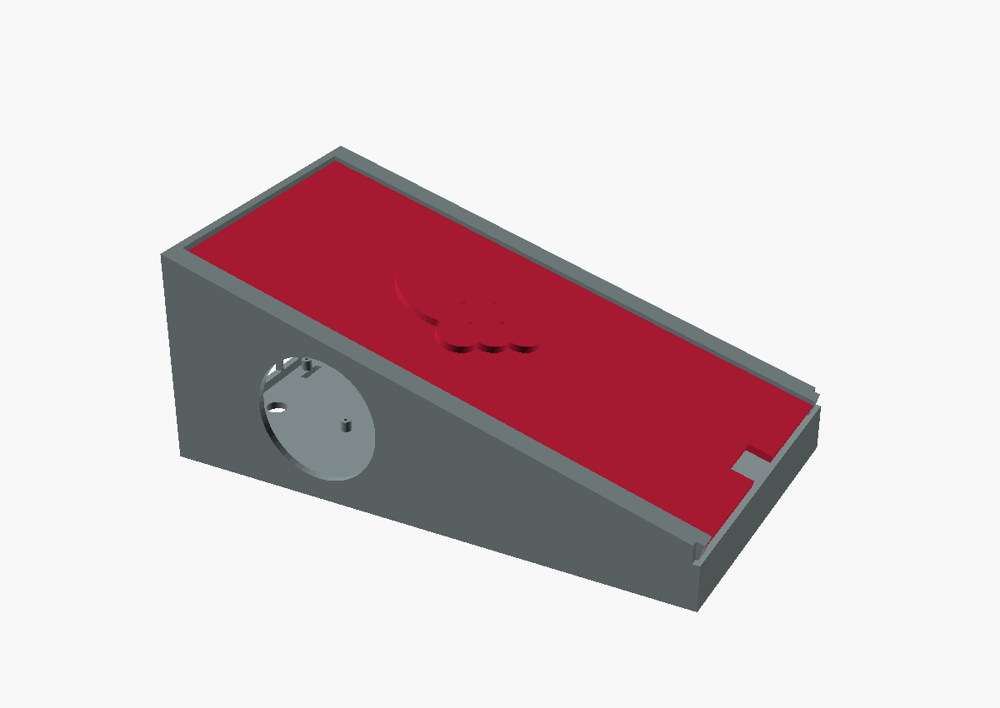

# RPI5-case

A parametric, 3D-printable **Raspberry Pi 5 "monolith" wedge case**, modelled
in [OpenSCAD](https://openscad.org/) from a hand-drawn concept sketch.



## The concept

The case is a long wedge / ramp — tall at the front, sloping down to a thin
back edge — built straight from the sketch's key details:

| Sketch note | In the model |
|---|---|
| 30 cm long, 17 cm wide | `L = 300`, `W = 170` |
| Wedge that slopes down to the back | `front_h = 120` → `back_h = 35` |
| "All the side ports" on the front | individual Pi 5 USB / Ethernet port holes in the front face |
| A hole on the side | plain round vent hole in the side wall |
| Raspberry Pi logo on top | stylised berry-and-leaves logo embossed on the roof |
| Underneath: power button + micro-SD | holes in the floor under the board |
| "Print in two halves (15 cm + 15 cm)" | `body_front` + `body_back`, cut across the middle, with dowel holes |
| "Roof is separate, slides in/out of a slot" | roof rides in a C-channel; the back is open as the slot |

## Files

```
rpi5_case.scad              parametric source (single file, edit this)
stl/
  rpi5_case_assembled.stl   whole case, roof in place (visualisation)
  rpi5_case_body.stl        the body as one piece
  rpi5_case_body_front.stl  front half, 0..150 mm   (print this)
  rpi5_case_body_back.stl   back half, 150..300 mm  (print this)
  rpi5_case_roof.stl        the sliding roof, laid flat (print this)
renders/                    reference images
```

The three parts you print are **`body_front`**, **`body_back`** and
**`roof`**. All STL parts are watertight, valid 2-manifolds.

## How the roof slot works

Each side wall carries an inner **C-channel rail**: a lip captures the roof
from above and a ledge supports it from below. The roof is a flat panel whose
two long edges slide along these channels. The back wall is lowered, leaving an
open **slot** — you slide the roof in from the back until it stops against the
tall front wall, and slide it back out to open the case. A finger-pull notch on
the roof's back edge makes it easy to grab.

```
        ___ lip                  cross-section of one side rail
       |   |___  roof panel ___
       |   |_____________________
   rail|                          <- roof slides along here
       |    ____________________
       |___|  ledge
       | wall
```

## Printing notes

* **Size / bed.** The case is intentionally large (30 × 17 cm). It is cut
  across the middle into two 150 mm halves so each footprint is 150 × 170 mm
  (front half up to 120 mm tall, back half up to ~78 mm); the roof is
  307 × 153 mm. If your bed is smaller, scale the whole model down in your
  slicer, or lower `L` in the source — everything is parametric.
* **Orientation.** Print each body half sitting on its flat bottom, and the
  roof flat (logo up). No supports are needed for the roof; the rail lips print
  cleanly in that orientation.
* **Assembly.** Join the front and back halves along the mid-length seam
  (4 × Ø3 mm dowel holes in the side walls are provided for alignment — glue or
  pin them). Mount the Pi on the four standoffs (`58 × 49 mm`, M2.5) so its
  USB/Ethernet edge lines up with the front port holes, then slide the roof in
  from the back.
* **Colour.** Print the roof in red and the logo will read as a raised
  Raspberry Pi mark; for the official two-tone look, do a filament change at
  the top of the roof layer so the berries/leaves come out in colour.

## Editing / regenerating

Open `rpi5_case.scad` in OpenSCAD and tweak the variables at the top
(dimensions, wall thickness, vent diameter, port-hole sizes, roof-joint
clearances, Pi mount spacing, …). To regenerate the STLs from the command line:

```sh
make            # renders every part into stl/
# or individually:
openscad -o stl/rpi5_case_roof.stl --export-format binstl -D 'part="roof"' rpi5_case.scad
```

Valid `part` values: `assembled`, `body`, `body_front`, `body_back`, `roof`,
`exploded`.
